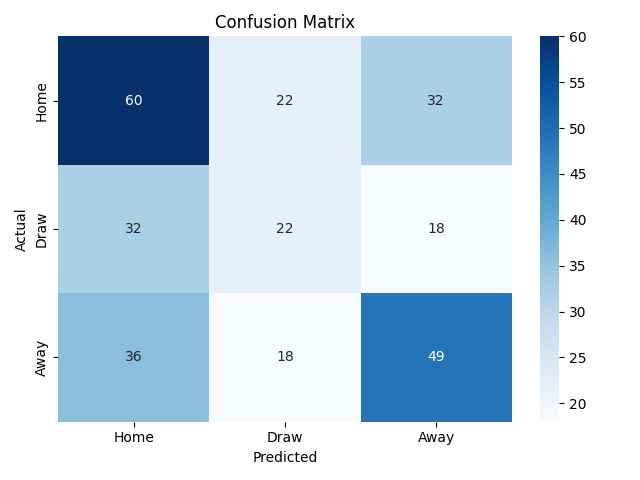

# 🧠 High-Performance Sports Match Predictor


This project simulates and predicts football match outcomes using a combination of **Poisson goal modeling**, **Bayesian updating**, and **Monte Carlo simulation**. It focuses on realistic, match-by-match predictions using historical Premier League data.
## 📊 Project Highlights
- 🔁 **Exponential decay weighting** for recent matches
- 🧮 **Smoothed Poisson distributions** for goal prediction
- 📈 **Bayesian updates** after each match to refine team strength
- 🎲 **Monte Carlo simulation** to estimate win/draw/loss probabilities
- ✅ Accuracy measured using real-world match results
## 📁 Data Structure
```
/data
│
├── /historical      → Last 10 seasons of EPL (e.g., E0_2014.csv, ..., E0_2023.csv)
└── /current         → Current season data (e.g., E0_2024.csv)
```
All data files come from [Football-Data.co.uk](https://www.football-data.co.uk/englandm.php).
## 🚀 Getting Started
### 1. Clone the repo
```bash
git clone https://github.com/your-username/high-performance-betting-model.git
cd high-performance-betting-model
```
### 2. Install dependencies
```bash
pip install -r requirements.txt
```
### 3. Run the model
```bash
python src/main.py
```
## 🔍 Example Output
📊 **Prediction Accuracy:** 

📉 Confusion Matrix: Visualizes how often each outcome (Home/Draw/Away) is correctly predicted
<p align="center">
  
</p>

## 🛠 How It Works
Each team’s scoring rate (λ) is initialized from 10 seasons of EPL data.

Historical matches are weighted with exponential decay to prioritize recent performance.

Before each match, win/draw/loss probabilities are estimated using Poisson-distributed goal simulations.

After each match, the team's expected goal rate is Bayesian updated based on actual goals.
## 🔮 Future Improvements
Incorporate bookmaker odds for value betting analysis

Add Elo ratings or integrate machine learning models

Extend to multiple leagues or seasons

Visual dashboards (e.g., Streamlit)
## 📦 Requirements
Python 3.8+ with numpy, pandas, matplotlib, seaborn, scikit-learn  

Install with:
```bash
pip install -r requirements.txt
```
## 📄 License
MIT License. Feel free to use and modify — but please credit the original author if sharing.

✨ Maintained by [Grace Chen](https://github.com/chenyurongrace)
